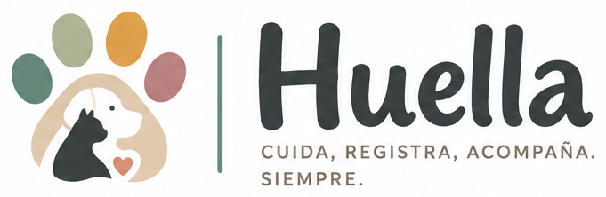

<p align="center">
  
</p>

<p align="center">
  <em>La historia clínica que el veterinario no te da.</em>
</p>

<p align="center">
  <a href="https://github.com/pablomandile/huella/actions/workflows/tests.yml">
    
  </a>
</p>

---

Huella es una app web personal para llevar el historial de salud y la vida cotidiana
de tus mascotas. El eje es el **diario**: una sola línea de tiempo donde conviven
visitas, vacunas, desparasitaciones, tratamientos, dietas, pesos, celos y notas.

Está pensada para el momento en que realmente se usa: **parado en el mostrador de la
veterinaria, con el celular en una mano y el perro en la otra.** De ahí salen casi
todas las decisiones de diseño: mobile first, carga en pocos taps, sheets en vez de
modales, y campos que aceptan un registro incompleto antes que perderlo.

**El sistema registra, no aconseja.** No hay ninguna recomendación clínica: las
próximas fechas que calcula son sugerencias precargadas y siempre editables.

## Qué hace

- **Diario unificado** con filtros por tipo y rango, búsqueda y paginado por cursor.
- **Visitas** con diagnóstico, indicaciones, tratamientos y adjuntos (recetas,
  estudios, fotos) en un solo envío.
- **Medicación**: genera las tomas de cada tratamiento y las muestra en una pantalla
  de "hoy" que se marca en un tap.
- **Plan preventivo**: vacunas y desparasitaciones con la próxima dosis precargada.
- **Recordatorios** por email, evaluados en la zona horaria de cada usuario.
- **Seguimiento**: curva de peso, dietas y ciclos de celo con estimación del próximo.
- **Historia clínica en PDF** —con las alergias arriba, que es lo que se necesita en
  una urgencia— y exportación de todos tus datos en JSON.
- **PWA instalable**, con service worker propio.

## Stack

Laravel 13 · PHP 8.4 · MySQL 8 · Inertia 3 · Vue 3 + TypeScript · Tailwind 4 · Vite

Auth por Fortify (2FA y passkeys incluidos). Rutas tipadas con Wayfinder.
Tests con Pest 4. Gráficos con Chart.js. PDF con dompdf.

## Cómo levantarlo

Requiere PHP 8.4, Composer, Node 22+ y MySQL 8.

```bash
git clone https://github.com/pablomandile/huella.git
cd huella
composer setup        # instala, crea el .env, genera la key, migra y compila
php artisan db:seed   # catálogos argentinos + una mascota de demo con historia
composer dev          # servidor + Vite
```

`composer setup` espera una base `huella` en MySQL con las credenciales del
`.env.example`. Entrás con **demo@huella.test** y la contraseña `password`.

Los seeders están separados a propósito: `CatalogosSeeder` es semilla compartida
(vacunas, antiparasitarios, alimentos, con `usuario_id` NULL) y también corre en
producción; `DemoSeeder` crea la mascota de ejemplo y **se niega a correr en
producción**, así que al desplegar se corre solo el primero:

```bash
php artisan db:seed --class=CatalogosSeeder --force
```

## Comandos

| Comando | Qué hace |
|---|---|
| `php artisan test` | Pest |
| `composer ci:check` | todo lo que corre el CI: Pint, PHPStan, ESLint, Prettier, vue-tsc y Pest |
| `./vendor/bin/pint` | formato PHP |
| `npm run format` | Prettier |
| `npm run lint` | ESLint |
| `npm run types:check` | vue-tsc |
| `composer types:check` | PHPStan (Larastan) |

## Decisiones que conviene conocer antes de tocar el código

- **Las fechas se persisten siempre en UTC** y se convierten con la
  `zona_horaria` de cada usuario al mostrar y al evaluar recordatorios. El
  timezone global está fijo en UTC a propósito: cambiarlo rompe el diseño.
- **Las páginas Inertia van en `resources/js/pages`, en minúscula.** Linux
  distingue mayúsculas y un case equivocado rompe el build y los tests aunque en
  Windows ande.
- **La autorización de mascotas pasa por el pivote `mascota_usuario`**, nunca
  comparando `usuario_id` a mano. Es lo que va a permitir sumar multi-cuidador
  sin reescribir ninguna Policy.
- **Los adjuntos viven en el disco privado** y los sirve un controlador después
  de verificar propiedad. Nunca hay una URL pública a una receta.
- **Los recordatorios los generan observers**, no los controladores, y son
  idempotentes.
- El service worker es propio (`public/sw.js`), sin `vite-plugin-pwa`. **Las
  respuestas de Inertia no se cachean**: son datos clínicos, y mostrar una dosis
  vieja es peor que mostrar un cartel de "sin conexión".

Las convenciones completas están en [CLAUDE.md](CLAUDE.md), y los documentos de
diseño —especificación, esquema de datos y plan de trabajo— en [docs/](docs/).

## Deploy

Corre en Hostinger compartido. Los pasos, las trampas del hosting y los cron del
scheduler están en [docs/deploy.md](docs/deploy.md).
